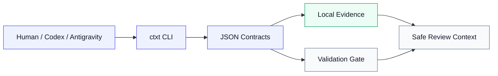
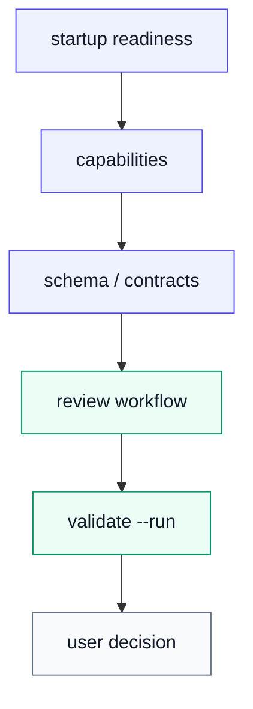
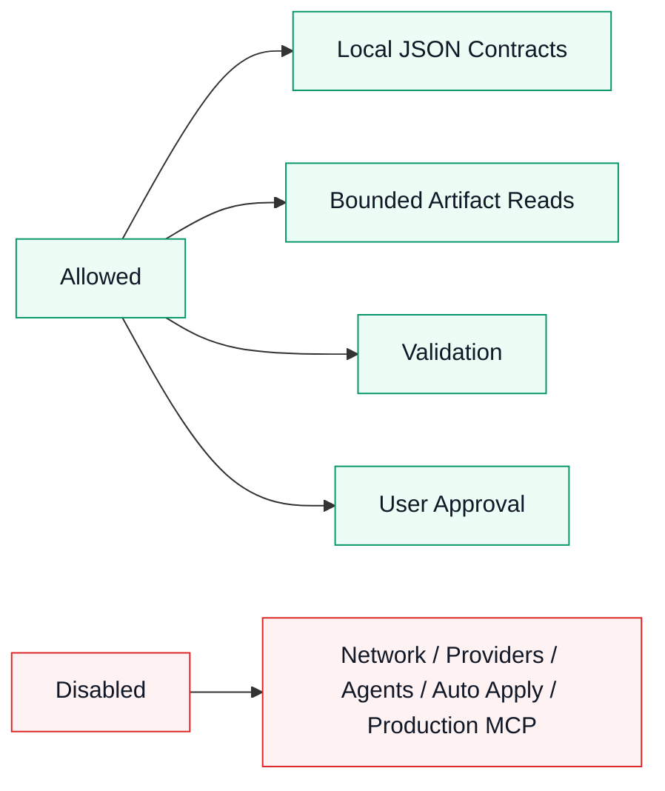

<p align="center">
  
</p>

<div align="center">

# CompText `ctxt`

**Deterministic local CLI runtime for agent-readable JSON contracts.**

**Models are providers. Context is the product.**

It does not execute external agents, use network, call providers, apply proposals or reviews, or run subagents.


</div>

> **Safety boundary**
>
> `ctxt` is local-first. Network is denied by default. Provider calls are not part of the documented workflow. External agent execution is disabled. Proposal and review artifacts are evidence, not instructions to auto-apply. Subagent role contracts are available, but subagents do not execute. The MCP-style stdio adapter is local-only and experimental; no production MCP support or full MCP compliance is claimed.

CompText `ctxt` v0.1.0 is a release candidate until the release is tagged.

## Table of Contents

- [30-Second Explanation](#30-second-explanation)
- [Install / Run](#install--run)
- [Using With Codex / Antigravity](#using-with-codex--antigravity)
- [Experimental Runtime Contract](#experimental-runtime-contract)
- [Command Matrix](#command-matrix)
- [Capability Matrix](#capability-matrix)
- [Architecture](#architecture)
- [Review Workflow](#review-workflow)
- [Safety Matrix](#safety-matrix)
- [Validation Evidence](#validation-evidence)
- [Distribution / Release Channel](#distribution--release-channel)
- [Roadmap](#roadmap)
- [Contributing](#contributing)
- [License](#license)

## 30-Second Explanation

**What it is:** `ctxt` is a Rust CLI that emits deterministic JSON contracts for local agent and reviewer workflows.

**Why it exists:** agent sessions need a reliable way to inspect startup state, supported commands, disabled gates, local artifacts, and validation evidence before making claims or attempting higher-risk work.

**Who uses it:** humans, Codex, Antigravity, and other local automation can call the same `ctxt --json ...` entrypoints to read the project contract surface without widening permissions.

The product is the context boundary: stable inputs, explicit gates, bounded artifacts, and local validation before provider interaction is considered.

## Install / Run

### Current Source Workflow

Run from a checked-out copy of this repository:

```powershell
cargo run --bin ctxt -- --json capabilities
```

Useful first checks:

```powershell
cargo run --bin ctxt -- --json self report
cargo run --bin ctxt -- --json startup readiness
cargo run --bin ctxt -- --json startup flow
cargo run --bin ctxt -- --json review workflow
```

For a small terminal demo plan, see [docs/DEMO.md](docs/DEMO.md).

### Planned Release Workflow

The crate install path is planned for the tagged release. Until the crate is published, use the source workflow above.

```powershell
cargo install comptext-cli --locked
ctxt --json capabilities
```

## Using With Codex / Antigravity

`ctxt` gives Codex, Antigravity, and human reviewers a shared local contract surface. It is an adapter-friendly runtime boundary, not a remote orchestration layer.

Before edits:

```powershell
cargo run --bin ctxt -- --json startup readiness
cargo run --bin ctxt -- --json capabilities
cargo run --bin ctxt -- --json review workflow
```

After edits:

```powershell
cargo run --bin ctxt -- --json validate --run
```

The commands above are local CLI invocations. They do not enable provider calls, network access, external agent execution, proposal application, review application, or subagent runtime execution.

## Experimental Runtime Contract

For the local runtime experiment, see [docs/RUNTIME_CONTRACT.md](docs/RUNTIME_CONTRACT.md). It covers the command matrix, stdout/stderr behavior, JSON behavior, MCP-style stdio error contract, bounded reads, and evidence hash scope. This is experimental local runtime support, not a production MCP support or full MCP compliance claim.

## Command Matrix

| Command | Purpose | Output | Boundary |
|---|---|---:|---|
| `cargo run --bin ctxt -- --json self report` | Runtime baseline and safe entrypoints | JSON | Read-only contract |
| `cargo run --bin ctxt -- --json schema` | Stable command-shape discovery | JSON | Static contract |
| `cargo run --bin ctxt -- --json capabilities` | Supported features and disabled gates | JSON | Read-only contract |
| `cargo run --bin ctxt -- --json startup readiness` | Startup readiness report | JSON | Contract-only |
| `cargo run --bin ctxt -- --json startup flow` | Safe startup sequence | JSON | Contract-only |
| `cargo run --bin ctxt -- --json review workflow` | Deterministic review workflow plan | JSON | Contract-only |
| `cargo run --bin ctxt -- --json subagents list` | Subagent role contracts | JSON | Role definitions only |
| `cargo run --bin ctxt -- --json proposals list` | Local proposal artifact index | JSON | Read-only evidence |
| `cargo run --bin ctxt -- --json proposals inspect latest --max-bytes 12000` | Bounded proposal read | JSON | Read-only evidence |
| `cargo run --bin ctxt -- --json proposals validate latest` | Proposal artifact contract check | JSON | Validation only |
| `cargo run --bin ctxt -- --json reviews list` | Local review artifact index | JSON | Read-only evidence |
| `cargo run --bin ctxt -- --json reviews inspect latest --max-bytes 12000` | Bounded review read | JSON | Read-only evidence |
| `cargo run --bin ctxt -- --json reviews validate latest` | Review artifact contract check | JSON | Validation only |
| `cargo run --bin ctxt -- --json agent discover` | Local agent discovery metadata | JSON | Discovery only |
| `cargo run --bin ctxt -- --json runs list` | Local run artifact index | JSON | Read-only evidence |
| `cargo run --bin ctxt -- --json runs read latest --max-bytes 12000` | Bounded run artifact read | JSON | Read-only evidence |
| `cargo run --bin ctxt -- --json validate --run` | Local validation contract execution | JSON | Local validation |

## Capability Matrix

| Capability | v0.1.0 RC status | Notes |
|---|---:|---|
| Runtime self-reporting | Available | Local JSON contract |
| Schema introspection | Available | Stable output-shape discovery |
| Capabilities introspection | Available | Reports supported features and disabled gates |
| Startup readiness | Available | Contract-only readiness report |
| Startup flow | Available | Contract-only startup checklist |
| Review workflow planning | Available | Deterministic workflow checklist |
| Proposal artifact listing | Available | Local evidence inspection |
| Proposal artifact inspection | Available | Bounded reads with max-byte limits |
| Proposal artifact validation | Available | Contract validation only |
| Review artifact listing | Available | Local evidence inspection |
| Review artifact inspection | Available | Bounded reads with max-byte limits |
| Review artifact validation | Available | Contract validation only |
| Subagent role contracts | Available | Deterministic role definitions only |
| Local agent discovery | Available | Metadata discovery only |
| Run artifact inspection | Available | Local evidence inspection |
| Local validation | Available | `validate --run` contract |
| Binary/media context-pack exclusion | Available | README assets do not break context packing |
| MCP-style stdio adapter | Experimental local-only | No production MCP support or full MCP compliance claim |
| Provider gateway | Not implemented | No live provider gateway claim |
| External agent execution | Disabled | Contracts and discovery do not execute agents |
| Proposal or review application | Disabled | Artifacts are not auto-applied |
| Subagent runtime execution | Disabled | Role contracts are not runtime execution |

## Architecture

Three callers share one local runtime boundary. The output is contract data and evidence for a safe review context.

<details>
<summary>Architecture diagram</summary>



</details>

`ctxt` keeps the first interaction local and deterministic. Callers ask the runtime what is supported, what is disabled, what evidence exists, and what validation says.

## Review Workflow

The review path stays short: inspect readiness, confirm capabilities and contracts, run the review checklist, then validate before the user decides.

<details>
<summary>Review workflow diagram</summary>



</details>

The review workflow is a checklist contract. It does not run hidden automation, invoke external agents, call providers, apply artifacts, or change Git state.

## Safety Matrix

The safety boundary separates local contract work from disabled execution gates.

<details>
<summary>Safety boundary diagram</summary>



</details>

| Boundary | Default | README R2 wording |
|---|---|---|
| Network | Denied | Local-first workflow; no network by default |
| Provider calls | Disabled | Providers are not called by documented contract inspection |
| External agents | Disabled | Discovery metadata is not execution |
| Proposal apply | Disabled | Proposal artifacts are untrusted evidence |
| Review apply | Disabled | Review artifacts are untrusted evidence |
| Subagent runtime execution | Disabled | Subagent role contracts are available only as definitions |
| MCP-style stdio adapter | Local-only experiment | No production MCP support or full MCP compliance claim |
| Provider gateway | Not implemented | No provider gateway claim |
| Hooks and plugins | Disabled for this flow | Not required for release-candidate validation |
| Arbitrary shell | Out of scope | Use declared local validation commands |
| Secrets | Never read or printed | Secret material must not enter artifacts or reports |
| Git writes | User-authorized only | Commit, push, tag, and release require explicit instruction |

## Validation Evidence

Current local release-candidate baseline from `PROJEKT.md`:

```text
cargo fmt --all --check: green
cargo check: green
cargo test: green
cargo clippy -- -D warnings: green
cargo run --bin ctxt -- --json validate --run: green
unit tests: 38 green
smoke tests: 83 green
```

Recommended local validation:

```powershell
cargo fmt --all --check
cargo check
cargo test
cargo clippy -- -D warnings
cargo run --bin ctxt -- --json validate --run
```

For README-only edits, the minimum documentation check is:

```powershell
git --no-pager diff -- README.md
git --no-pager status --short --branch
```

## Distribution / Release Channel

v0.1.0 is currently a release candidate. The source workflow is the supported path until the release is tagged and the crate publication decision is made.

Release actions that remain separate from this README:

- tag creation,
- GitHub Release creation,
- crate publication,
- cargo-dist initialization,
- social preview setup.

Do not infer that any of those actions have happened from this README.

## Roadmap

Near-term release-candidate priorities:

- keep README, release notes, and project state aligned,
- preserve deterministic JSON contract behavior,
- keep local validation green,
- document Codex and Antigravity usage through `ctxt`,
- keep binary and media assets outside context packing,
- decide release tag and distribution channel only after CI is green.

Later work may expand installation paths, packaging, and visual launch assets without changing the core local-first boundary.

## Contributing

Contributions should preserve the project contract:

- deterministic Context Packs before provider interaction,
- dry-run before network,
- proposal before apply,
- model, provider, and tool output treated as untrusted input,
- local validation before success claims,
- no secrets in stdout, stderr, reports, context packs, proposals, snapshots, logs, or generated artifacts.

Use the same startup checks before changing behavior:

```powershell
cargo run --bin ctxt -- --json startup readiness
cargo run --bin ctxt -- --json capabilities
cargo run --bin ctxt -- --json review workflow
```

## License

MIT.

<p align="center">
  
</p>
